# Transformations

> There are much better ways to transform an object and that's by using (multiple) matrix objects.

> Matrices are very powerful mathematical constructs that seem scary at first.

## Vectors

Vectors are **directions** and nothing more.

A vector has a **direction** and a **magnitude** (also known as its _strength_ or _length_).

Like a treasure map:
- go left 10 steps
- go north 3 steps
- go right 5 steps

In this context, "left" is the **direction** and "10 steps" is the **magnitude** of the vector.

Vectors can have any dimension but usually work with dimen sions of 2 to 4.

If a vector has 2 dimensions, it represents a direction on a plane (2d graphs) and when it has 3 dimensions it can represent any direction in a 3D world.

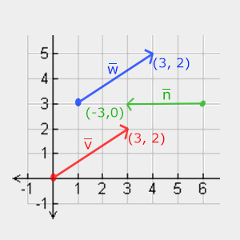

These three vectors are represented with `(x,y)` as arrows in a 2D graph.

When describing vectors, mathematicians generally prefer to describe vectors as character symbols with a little bar over their head like `v` 

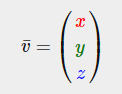

### Scalar Vector Operations

A **scalar** is a single digit. When adding/subtracting/multiplying or dividing a vector with a scalar we simply add/subtract/multiply or divide each element of the vector by a scalar.

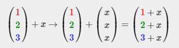

### Vector negation

Negating a vector results in a vector in the reversed direction.

> A vector pointing north-east would point south-west after negation.

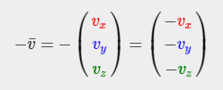

### Addition and Subtraction

Addition of two vectors is defined as **component-wise** addition, that is each component of one vector is added to the same component of the other vector.

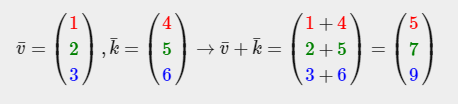
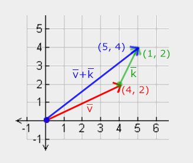

### Length

To retrieve the length/magnitude of a vector we use **Pythagoras theorem**.

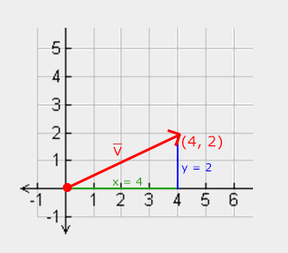

There is also a special type of vector that we call a **unit vector**. It has one extra property and that is that its length is **exactly 1**.

We can calculate a unit vector from any vector by dividing each of the vector's components by its length.

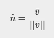

### Vector-vector Multiplication

Multiplying two vectors is a bit weird.

#### Dot Product

The dot product of two vectors is equal to the scalar product of their lengths times the cosine of the angle between them.

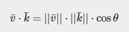

The dot product **only** defines the angle between both vectors.

The cosine or cos function becomes 0 when the angle is 90 degrees or 1 when the angle is 0.

This allows us to test if the two vectors are **orthogonal** or **parallel** to each other using the dot product.

So how do we calculate the dot product?

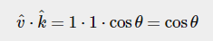
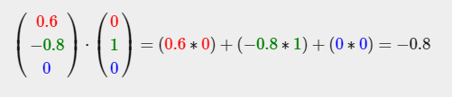

To calculate the degrees between both these unit vectors, we use the inverse of the cosine function `cos^-1` and this results in `143.1` degrees.

#### Cross Product

This is only defined in 3D space and takes two non-parallel vectors as input and produces a third vector that is orthogonal to both the input vectors.

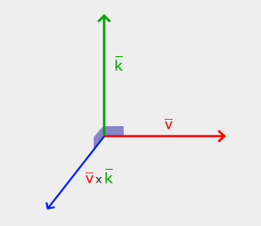

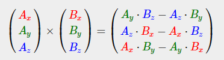

## Matrices TODO